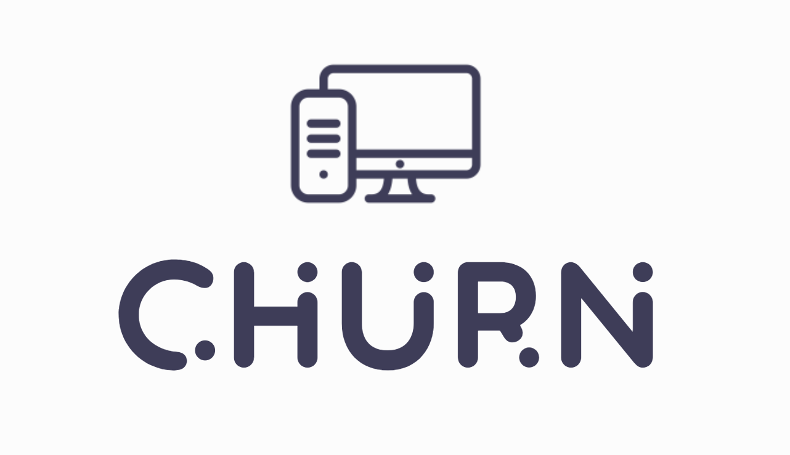
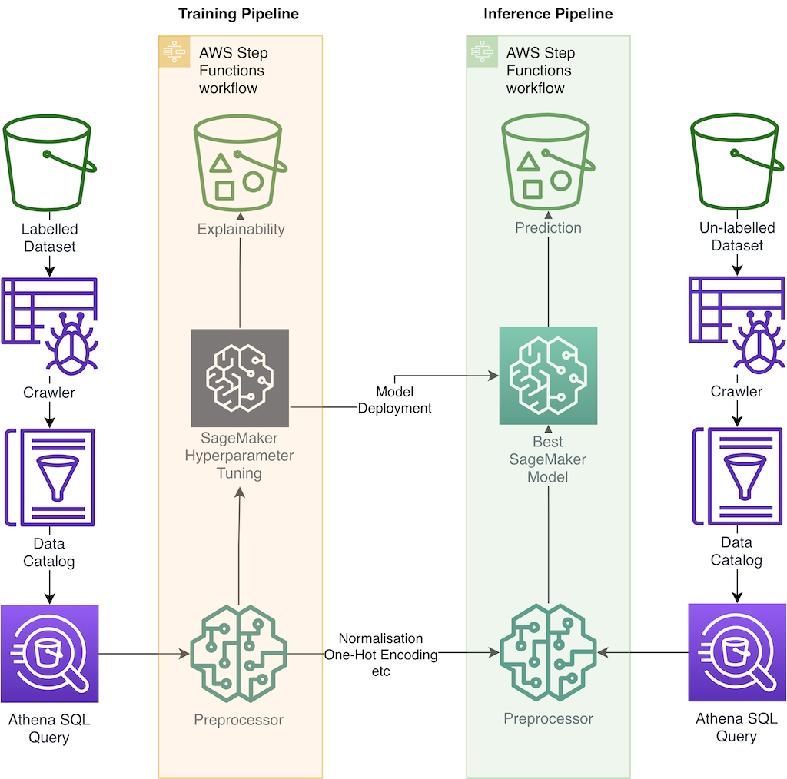

# Customer Churn Pipeline on AWS

*A production-focused End to End churn prediction pipeline on AWS*

It provides:

- One-click Training and Inference Pipelines for churn prediction
- Preprocessing, Validation, Hyperparameter tuning, and model Explainability all backed into the pipelines
- Amazon Athena and AWS Glue backend that allows for the pipeline to scale on demand and with new data
- End to End Implementation for your own custom churn pipeline

> An [AWS Professional Service](https://aws.amazon.com/professional-services/) open source initiative | aws-proserve-opensource@amazon.com

## Table of contents

- [Quick Start](#quick-start)
- [Read The Docs](#read-the-docs)
- [Soution Architecture](#solution-architecture)
- [Contributing](#contributing)

## Quick Start

    # Set up the resources
    ./standup.sh

    AWS_REGION=$(aws configure get region)

    # Trigger the training pipeline
    aws lambda --region ${AWS_REGION} invoke --function-name invokeTrainingStepFunction --payload '{ "": ""}' out

    # Trigger the inference pipeline
    aws lambda --region ${AWS_REGION} invoke --function-name invokeInferStepFunction --payload '{ "": ""}' out

    # Clean up
    ./delete_resources.sh

## [Read The Docs](https://awslabs.github.io/aws-customer-churn-pipeline/)

## Solution Architecture

## Contributing

For how to Contribute [see here.](https://github.com/awslabs/aws-customer-churn-pipeline/blob/main/docs/contributing.md)
