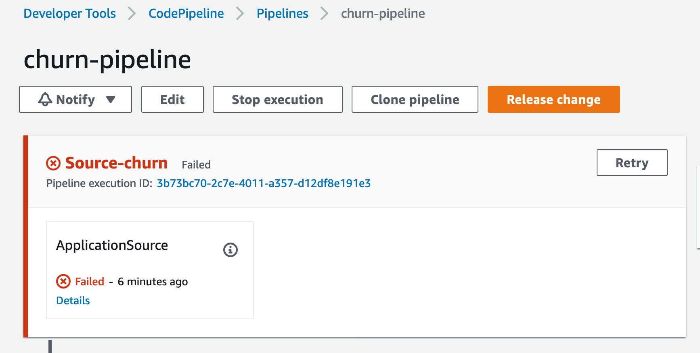

# Customer Churn Pipeline on AWS

*A production-focused End to End churn prediction pipeline on AWS*

It provides:

- One-click Training and Inference Pipelines for churn prediction
- Preprocessing, Validation, Hyperparameter tuning, and model Explainability all backed into the pipelines
- Amazon Athena and AWS Glue backend that allows for the pipeline to scale on demand and with new data
- End to End Implementation for your own custom churn pipeline

> An [AWS Professional Service](https://aws.amazon.com/professional-services/) open source initiative | aws-proserve-opensource@amazon.com

## Table of contents

- [Customer Churn Pipeline on AWS](#customer-churn-pipeline-on-aws)
  - [Table of contents](#table-of-contents)
  - [Quick Start](#quick-start)
  - [Read The Docs](#read-the-docs)
  - [Solution Architecture](#solution-architecture)
  - [Contributing](#contributing)

## Quick Start

    # Step 1 - Verify default parameters are in .env file. To run with Cox proportional hazard modeling instead of binary logloss set COXPH to 'positive'. 

    # Step 2 - Deploy infrastructure. 
    ./standup.sh

    # Step 3 - Update the pending Github connection manually in the console and release change in churn pipeline. This is a one time approval. 
  

  
  

  

  
  

    # Step 4 - Once the build succeeds, navigate to Step Functions to verify completion

    # Step 5 - Trigger Inference pipeline. This can be further scheduled based on cron jobs or S3 triggers as required. 
    
    AWS_REGION=$(aws configure get region)

    aws lambda --region ${AWS_REGION} invoke --function-name invokeInferStepFunction --payload '{ "": ""}' out

    # Clean up
    ./delete_resources.sh

## [Read The Docs](https://awslabs.github.io/aws-customer-churn-pipeline/)

[Documentation](https://awslabs.github.io/aws-customer-churn-pipeline/)

In addition, check out the blog posts:

* [Deploying a Scalable End to End Customer Churn Prediction Solution with AWS](https://towardsdatascience.com/deploying-a-scalable-end-to-end-customer-churn-prediction-solution-with-aws-cbf3536be996)!
* [Retain Customers with Time to Event Modeling-Driven Intervention](https://towardsdatascience.com/retain-customers-with-time-to-event-modeling-driven-intervention-de517a39c6e3)

## Solution Architecture

## Contributing

For how to Contribute [see here.](https://github.com/awslabs/aws-customer-churn-pipeline/blob/main/CONTRIBUTING.md)
